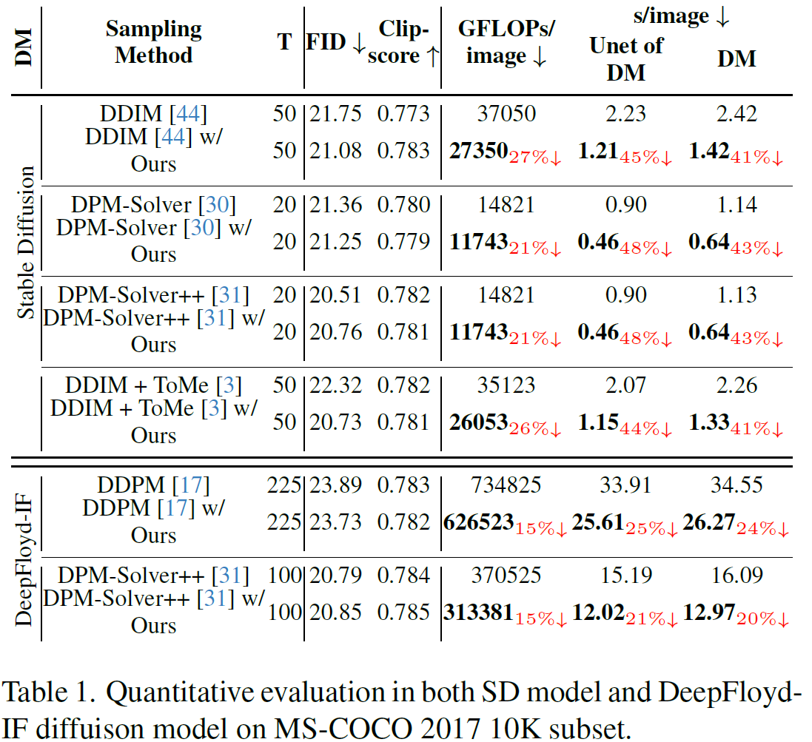
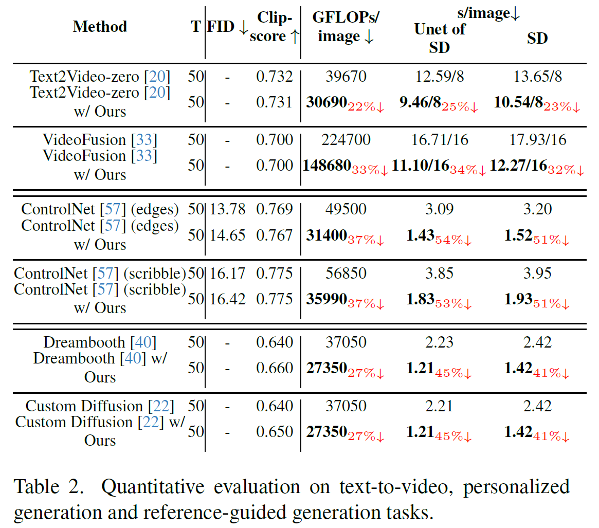

# 🚀 Faster Diffusion: Rethinking the Role of UNet Encoder in Diffusion Models

<div align="center">

  <br>
  <em>
      Our approach can easily be combined with various diffusion model-based tasks 🧠 (such as text-to-image, personalized generation, video generation, etc.) and various sampling strategies (like DDIM-50 steps, Dpm-solver-20 steps) to achieve training-free acceleration.
  </em>
</div>

<be>
<be>


## 📋 TODO List

- [x] Release code that combines our method with [Stable Diffusion](https://huggingface.co/runwayml/stable-diffusion-v1-5) ;
- [x] Release code that combines our method with [DeepFloyd-IF](https://huggingface.co/DeepFloyd/IF-I-XL-v1.0);
- [x] Release code that combines our method with  [ControlNet](https://github.com/lllyasviel/ControlNet)(We released the code that supports canny condition, for other conditions, you can modify code by the same way.);
- [ ] Release code that combines our method with [Text2Video-zero](https://github.com/Picsart-AI-Research/Text2Video-Zero) and [VideoDiffusion](https://modelscope.cn/models/damo/text-to-video-synthesis/summary);
- [ ] Release code that combines our method with [DreamBooth](https://github.com/XavierXiao/Dreambooth-Stable-Diffusion) and [Custom Diffusion](https://github.com/adobe-research/custom-diffusion);

## 📘 Introduction

> **Faster Diffusion: Rethinking the Role of UNet Encoder in Diffusion Models**
>
> [Senmao Li](https://github.com/sen-mao)\*, [Taihang Hu](https://github.com/hutaiHang)\*, [Fahad Khan](https://sites.google.com/view/fahadkhans/home), [Linxuan Li](https://github.com/Potato-lover), [Shiqi Yang](https://www.shiqiyang.xyz/), [Yaxing Wang](https://yaxingwang.netlify.app/author/yaxing-wang/), [Ming-Ming Cheng](https://mmcheng.net/), [Jian Yang](https://scholar.google.com.hk/citations?user=6CIDtZQAAAAJ&hl=en)
>
> 📚[arXiv](https://arxiv.org/abs/2312.09608) 🌈[Project Page](https://sen-mao.github.io/FasterDiffusion/);

***Denotes equal contribution.**

We propose FasterDiffusion, a training-free diffusion model acceleration scheme that can be widely integrated with various generative tasks and sampling strategies. Quantitative evaluation metrics such as FID, Clipscore, and user studies all indicate that our approach is on par with the original model in terms of genenrated-image quality. Specifically, we have observed the similarity of internal features in the Unet Encoder at adjacent time steps in the diffusion model. Consequently, it is possible to reuse Encoder features from previous time steps at specific time steps to reduce computational load. We propose a feature propagation scheme for accelerated generation, and this feature propagation enables independent computation at certain time steps, allowing us to further leverage GPU acceleration through a parallel strategy. Additionally, we introduced a prior noise injection method to improve the texture details of generated images. 

Our method is not only suitable for standard text-to-image(**~1.8x acceleration for [Stable Diffusion](https://huggingface.co/runwayml/stable-diffusion-v1-5) and ~1.3x acceleration for [DeepFloyd-IF](https://huggingface.co/DeepFloyd/IF-I-XL-v1.0)** ) tasks but can also be applied to diverse tasks such as text-to-video(**~1.5x acceleration  on [VideoDiffusion](https://modelscope.cn/models/damo/text-to-video-synthesis/summary))**, personalized generation(**~1.8x acceleration for [DreamBooth](https://github.com/XavierXiao/Dreambooth-Stable-Diffusion) and [Custom Diffusion](https://github.com/adobe-research/custom-diffusion)**), and reference-guided generation(**~2.1x acceleration for [ControlNet](https://github.com/lllyasviel/ControlNet)**), among others. 


<div align="center">
<em>Method Overview. For more details, please see our paper.
  </em>
</div>


## 🔧 Quick Start

- Create environment：

  ```shell
  conda create -n fastersd python=3.9
  conda activate fastersd
  pip install -r requirements.txt
  ```

- Execute

  ```shell
  # if using `stable diffusion`
  python sd_demo.py
  
  # if using `deepfloyd if`
  python if_demo.py

  #if using ControlNet(canny condition)
  python controlnet_demo.py
  ```
  sd_demo.py output
	  
    ```python
   Origin Pipeline: 2.524 seconds
   Faster Diffusion: 1.476 seconds
    ```
    
  controlnet_demo.py output
	  
    ```python
   Origin Pipeline: 3.264 seconds
   Faster Diffusion: 1.526 seconds
    ```  
  The above results were conducted using a 3090 GPU.
+ Usage

  Our method can easily integrate with the [diffusers](https://huggingface.co/docs/diffusers/index) library. Below is an example of integration with [stable-diffusion v1.5](https://huggingface.co/runwayml/stable-diffusion-v1-5).

<details>
<summary>For Stable Diffusion</summary>


  ```python
from diffusers import StableDiffusionPipeline
import torch
from utils_sd import register_normal_pipeline, register_faster_forward, register_parallel_pipeline, seed_everything  # 1.import package

seed_everything(2023)
model_id = "runwayml/stable-diffusion-v1-5"
pipe = StableDiffusionPipeline.from_pretrained(model_id, torch_dtype=torch.float16)
pipe = pipe.to("cuda")

#------------------------------
# 2. enable parallel. If memory is limited, replace it with  `register_normal_pipeline(pipe)`
register_parallel_pipeline(pipe) 
# 3. encoder propagation
register_faster_forward(pipe.unet) 
#------------------------------
prompt = "a cat wearing sunglasses"
image = pipe.call(prompt).images[0]  
    
image.save("cat.png")
  ```

</details>

## ✨ Qualitative results

### Text to Image

<div align="center">
    <b>
            ~1.8x acceleration for stable diffusion, 50 DDIM steps
    </b>
</div>


<div align="center">
    <b>
    ~1.8x acceleration for stable diffusion, 20 Dpm-solver++ steps
    </b>
</div>


<div align="center">
    <b>
    ~1.3x acceleration for DeepFloyd-IF
	</b>
</div>


###  Text to Video

<div align="center">
    <b>
    ~1.4x acceleration for Text2Video-Zero
	</b>
</div>


<p align="center">

<div align="center">
    <b>~1.5x acceleration for VideoFusion, origin video(left) and ours(right)</b>
</div>
</p>


### ControlNet

<div align="center">
    <b>
    ~2.1x acceleration for ControlNet
	</b>
</div>


### Personalized Generation

<div align="center">
    <b>
    ~1.8x acceleration for DreamBooth and Custom Diffusion
	</b>
</div>


### Other tasks based on Diffusion Model


<div align="center">
    <b>
    Integrate our method with other tasks, such as Image Editing(<a href="https://github.com/google/prompt-to-prompt">P2P</a>) and <a href="https://github.com/ziqihuangg/ReVersion">Reversion</a>
    </b>
</div>


## 📈  Quantitative results

<p align="center">
    
</p>

## Citation

```
@misc{li2023faster,
      title={Faster Diffusion: Rethinking the Role of UNet Encoder in Diffusion Models}, 
      author={Senmao Li and Taihang Hu and Fahad Shahbaz Khan and Linxuan Li and Shiqi Yang and Yaxing Wang and Ming-Ming Cheng and Jian Yang},
      year={2023},
      eprint={2312.09608},
      archivePrefix={arXiv},
      primaryClass={cs.CV}
}

